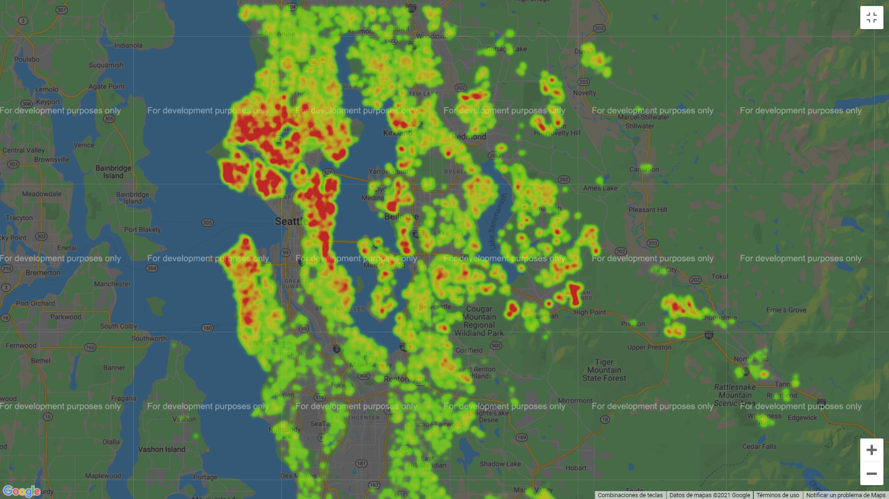
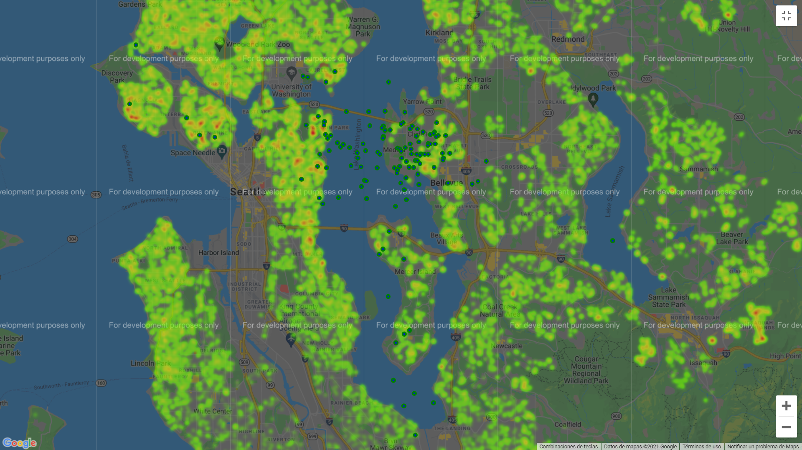

# 1. Business case

The goal is to predict the price of houses of a certain area in Northwest USA. In order to do so, we will apply a machine learning model on historic data of house sales in said area. We have information on about 21600 previous sales, and the data includes the area of the houses/apartments, the lot sizes, the number of rooms and bathrooms, and the coordinates of the house.

The data provided should allow us to obtain sufficient precision on the prediction of a price houses if we have similar information to the one with which we will be training the model.

# 2. Data import and Exploratory Data Analysis (EDA)

We will be working mostly with two data science packages that work together very effectively in a Python programming environment: Pandas, for convenient dataset manipulation, and Scikit-Learn, for quick implementation of machine learning algorithms. We will code the results in a Jupyter Notebook, which allows for interactive coding and facilitates the presentation of the results.

The **data import** procedure is automatic, since we are provided with an Excel file that we can incorporate directly in our environment with Pandas.

The **Exploratory Data Analysis** that we undertake reveals that the data is clean and well organised. We have 21 columns:
- id: an identifier for each sale.
- date: the date, in 2013 or 2014, when the house was sold.
- bedrooms and bathrooms: two columns for these numbers. The number of bathrooms ranges from 0.5 to 8, with intervals of 0.25. The bedrooms are integers between 1 and 33. 
- sqft_living and sqft_lot: the surfaces of the living area and the lot of the house, respectively. 
- sqft_living15 and sqft_lot15: from the information we have gathered, this corresponds to the avreage areas of the 15 nearest neighbors to the houses. But the information is not very clear. In the distribution there are clear outliers, with houses that are very big compared to the average ones. 
- floors: the number of floors, between 1 and 3.5.
- waterfront: a boolean variable, 0 correspond to no waterfront, 1 is a house with waterfront. The city of Seattle and it's surrounding areas are full of lakes, bays, and water bodies in general, so it makes sense to record this information. However, only 163 of the initial houses have a waterfront.
- view: the great majority has 0. The rest have between 2 and 4, but there are only 2000 of them.
- condition: 200 houses have 1 or 2, the rest between 3 and 5.
- grade: between 1 and 13, but very densely distributed around 7, the average.
- sqft_basement: the surface of the living space that corresponds to basement.
- sqft_above: it's the sqft_living variable minus the sqft_basement. So it is, in a sense, redundant information.
- yr_built: the year the house was built in. It ranges from 1900 to 2015.
- yr_renovated: 0 for houses that have not been renovated, otherwise the year when they were.

Presentation of the area where the houses were sold, color coded with the price.

From the first data analysis we creat a cleaning function that will do the following:
- Drop the rows which have 7 or more bedrooms: we are left with 21535 houses, so they are clearly outliers. Our model will not be able to predict the prices of houses with more than 6 bedrooms.
- Likewise, there are 58 houses with less than 1 bathroom, and 15 houses with 6 or more bathrooms (maximum of 8). We eliminate those rows.
- In the columns sqft_living and sqft_lots there are clear outliers, judging from the standar deviation. Only 55 houses have more than 6,000 square feet of living spaces, so we eliminate them. We also eliminate the houses with sqft_lot over 30000. We do the same for the sqft_living15 and sqft_lot15 columns. This leaves us with 19758 houses.
- As for the view column, the vast majority have 0 (more than 17500). Then 315 have 1, 853 have 2, 437 have 3, and 265 have 4. We will convert it to a binary variable, 0 if it is 0, 1 otherwise.
- Condition: only 168 houses have a condition of 1 or 2, so we will eliminate them as outliers. This leaves us with 21398 houses.
- sqft_basement: we convert this in a binary variable: 0 if no basement (around 12000) and 1 if basement (around 8000).
- Renovated: there are around 400 houses that have been renovated in 1990 and after, we will give them a 2. For the houses that were renovated before 1990, we will give a 1. For the rest that haven't been renovated, we will keep the 0 (vast majority).
- We drop the id and date columns. They don't relevant information that our model will be able to use.

This first **cleaning function** leaves us with 19479 houses.

However, after all the modeling part we undertake a new data cleaning for the elimination of outliers and confirming our assumptions about the initial data. Two new changes that we introduce are:
- We eliminate the column sqft_above, since it does not really add up information. It is the result of substracting two columns, one of which is so irrelevant in numbers that we have binarized it. The precision of the model increases accordingly.
- After the modeling part we realise that the accuracy increases when we limitate a little bit more the houses in relation to the sqft_living and sqft_lot columns. This reduces our dataset and the scope of our model, but we are not being too aggresive in the reduction. We keep the houses under 5000 sqft_living and 15000 sqft_lot, and the "15 columns".

After this **second cleaning function** our dataset has 17821 houses and 18 columns. For a measure of how the data is spread, the standard deviation in relation with the mean of the relevant (non binarized) columns is, in percentage:

bedrooms - 25.88
bathrooms - 34.86
sqft_living - 39.17
sqft_lot - 44.20
floors - 36.59
condition - 18.69
grade - 13.64
sqft_living15 - 32.02
sqft_lot15 - 41.51
price - 56.29

# 3. Modeling - regression algorithm

In order to start our model, we apply the usual machine language procedure:
- Divide the data in training and test sets.
- Scale the dataset with a normalization function.
- Train and test the algorithms, checking their accuracy.

Visualising the correlation matrix indicates that the most clear relation is between the price and the surface for living and the lot surface, which makes sense.

We test several machine learning algorithms. Here are their names and the found estimated accuracy:
- Linear Regression model - 77.59%
- Stochastic Gradient Descent regression - 77.90%
- Generalised Linear Regression - 79.84%
- Random Forest Regression - 87.66%

For each of these options we try to **test various combinations of variables**, that is, we check whether including or excluding different sets of columns increases the accuracy. For the Random Forest Model we see that the more information, the better. Two interesting results from this study:
1. The sqft_above is the only column that visibly decreases the accuracy of the model, that is why we drop it.
2. We realize that the geolocation data (latitude, longitude and zipcode) is extremely important for the model. 

This second finding seems like a good way of exploring how to further increase the model's accuracy, which is why we will try incorporating another alogorithm.

As a general description of the [Random Forest Algorithm](https://scikit-learn.org/stable/modules/ensemble.html#forest) we can quote the website www.towardsdatascience.com: "Random forest, like its name implies, consists of a large number of individual decision trees that operate as an ensemble. Each individual tree in the random forest emits a class prediction and the class with the most votes becomes the model’s prediction.The fundamental concept behind random forest is a simple but powerful one — the wisdom of crowds. A large number of relatively uncorrelated models (trees) operating as a committee will outperform any of the individual constituent models."

The complex mathematics behind this algorithm are beyond the scope of this study, but we can see that it fits our prediction needs perfectly.

# 4. Modeling - clustering system for geolocation data

Seeing how the location data is very important for the accuracy of the model, we make an **asumption** that we can in a certain manner simplify this location data and feed it to our model, maybe increasing our accuracy.

So, we will use a clustering algorithm, an unsupervised learning method that will create a series of clusters, defined by a geolocated cluster center that is comprised by its coordinates and an average price. The model chosen is the K-Means one, it automatically creates thes centers based only in the **training set**. We can visualise the calculated centers against the heatmap of the houses and their prices.

Then we use an algorithm that assigns, to each house, based on its location, one of these cluster centers. To detect the closest one we use a distance algorithm (KDTree). 

Since we have an average price, which corresponds to the cluster center, for each house, we will add it as a new column, calculated for both the training and test datasets. We will name this new column location_price. 

After several iterations with our Random Forest model, we see that the accuracy improves in a small percentage, of about 0.3%. And we also iterate throgh different numbers of clusters, finding that a good number of centers is 200. We will keep this clustering procedure for our final model.

# 5. Modeling - fine tuning of parameters

Hyperparameters are the settings in the algorithm that can be adjusted to optimize performance. Hyperparameters must be set before training. For Random Forest, Scikit-Learn implements intelligent default hyperparameters, but we want to see if we can optimize them for our particular model.

We must be careful to avoid models that overfit. Therefore, the standard procedure for parameter fine-tuning includes a cross validation system that tries to ensure that our model is not overfitting. We will use the K-fold method, one of the most widely used. 

After running a randomized search for the best parameter combinations, and running a second, more precise search based on that, we arrive at a set of parameters 

# 6. Final results and conclusion

The model has been iteratively tuned in order to find the maximum possible accuracy. Our model is based on the following steps:
1. Data cleaning: We drop several columns (date, id, sqft_above). We simplify others: view, to a binary 1 or 0; year renovated, 0 if not, 1 for renovations before 2000, 2 for renovations after that; sqft basement, to binary (1 for basement, 0 for no basement). We eliminate outliers: houses with more than 6 bedrooms; with more than 6 or less than 1 bathroom; where the sqft_living and sqft_lot are over 5000 and 15000, respectively, and including their "15"versions; also we eliminate the houses with condition 2 or under.
2. Clustering model: we run a clustering machine learning system, the K-Means, with the location and price data of the training dataset. This data is used to create clusters, every one of which has a center with an average price. We use the centers in a dataframe to assign to every house (training and test sets) one of this centers, using a distance algorithm (KDTree). The dataset is thus increased through a new column, location_price. For the number of clusters and their respective centers, we find that 150 is a good number
3. Regression model: we then apply a Random Forest Regression, which we have fine tuned with cross validation of the best parameters. We use 300 estimators, and a maximum depth of 100.

We arrive at the following results: 
- Average Absolute Error: 56168.8 dollars.
- Mean squared error: 95867.45
- Accuracy = 88.3%

Possible ways to perhaps increase the accuracy of the model:
1. Continue with the clustering model to see if we can increase accuracy. This would include exploring other algorithms, both for the clustering method and the minimum-distance funtion that assigns a cluster center to each house.
2. Consult with the clients if they would be willing to reduce the scope of the model, which could lead to an increase in accuracy. This would probably mean limiting the surface or maximum prices of the houses that we feed into our model, and thus reducing its capability of predicting the price of that kind of houses.
3. Localised models: in view of the importance of the geolocation data for the model, possibly the creation of localised models, by neighborhoods or smaller towns than Seattle, would make sense. The clustering system tries to account for this, in a way, but maybe other systems could be devised.
